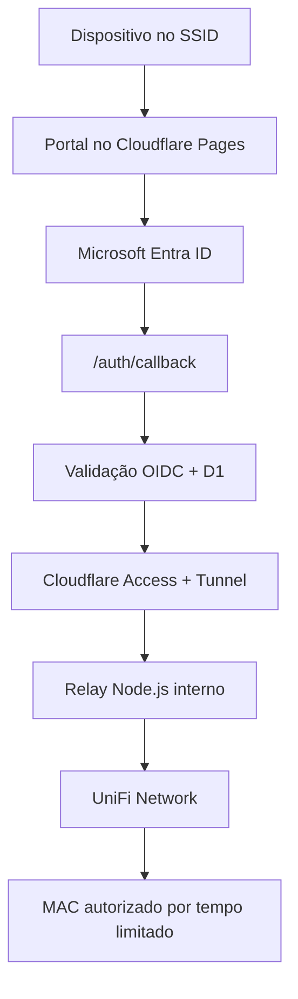

# Portal Wi‑Fi Alliance — Cloudflare + Microsoft Entra ID + UniFi

Implementação de referência para hospedar o portal em `wifi.allianceconsultoria.com.br`, autenticar colaboradores no Microsoft Entra ID e liberar o dispositivo no UniFi somente depois da validação.

O projeto não contém credenciais, não cria registros DNS e não altera o UniFi. Todos os segredos entram por variáveis criptografadas no Cloudflare ou por arquivo de ambiente local fora do Git.

## Arquitetura adotada



- `public/`: frontend responsivo do portal.
- `functions/`: Pages Functions para login, callback, vouchers, tokens e sessões.
- `migrations/`: tabelas D1 para estados OAuth, sessões, vouchers e tokens.
- `relay/`: serviço Node/TypeScript executado dentro da rede onde o UniFi está acessível.
- Cloudflare Tunnel: conexão somente de saída entre a rede local e o Cloudflare.

O GitHub pode guardar o código e disparar deployments do Pages. O GitHub Pages, isoladamente, não executa o callback seguro nem protege segredos; por isso o backend permanece no Cloudflare Pages Functions.

## Fluxo de colaborador

1. O UniFi redireciona o dispositivo para o portal e informa o MAC do cliente.
2. `/api/auth/login` cria `state`, `nonce` e PKCE, grava o estado no D1 e redireciona ao tenant Alliance.
3. O Entra ID retorna para `https://wifi.allianceconsultoria.com.br/auth/callback`.
4. O callback troca o código no back channel e valida assinatura, emissor, audiência, tenant, expiração, nonce e domínio de e-mail.
5. A Function chama o relay interno através de Cloudflare Access/Tunnel.
6. O relay executa `authorize-guest` no UniFi para o MAC recebido.
7. Apenas após a confirmação do UniFi, o portal cria a sessão e apresenta o acesso como autorizado.

O ID token e o client secret nunca são enviados ao JavaScript do navegador.

## Pré-requisitos

- Zona DNS ou subdomínio disponível para `wifi.allianceconsultoria.com.br`.
- Conta Cloudflare com Pages, D1, Zero Trust/Access e Tunnel.
- App Registration no tenant Microsoft Entra ID da Alliance.
- UniFi Network acessível a partir de um host interno com Node.js 20 ou 22.
- Usuário técnico dedicado no UniFi com o menor escopo que permita autorizar clientes do site escolhido.
- Um webhook de envio de e-mail para os tokens de visitantes, como Power Automate, Logic Apps ou serviço transacional.

## 1. Microsoft Entra ID

Crie um App Registration single-tenant para o portal:

- Platform: **Web** — o callback é processado no servidor, não em uma SPA.
- Redirect URI: `https://wifi.allianceconsultoria.com.br/auth/callback`.
- Fluxo: Authorization Code + PKCE + OpenID Connect.
- Scopes usados: `openid`, `profile` e `email`.
- Não habilite Implicit Grant.
- Gere um client secret com expiração e processo de rotação definidos.

Guarde:

- Directory (tenant) ID → `ENTRA_TENANT_ID`.
- Application (client) ID → `ENTRA_CLIENT_ID`.
- Valor do secret → `ENTRA_CLIENT_SECRET`.

O URI cadastrado deve corresponder exatamente ao domínio e ao caminho usados pelo portal.

## 2. Preparar o Cloudflare

Instale as dependências:

```bash
npm install
```

Autentique o Wrangler e crie o banco:

```bash
npx wrangler login
npx wrangler d1 create wifi-alliance-portal
```

Copie `wrangler.toml.example` para `wrangler.toml` e substitua `REPLACE_WITH_D1_DATABASE_ID` pelo ID retornado. O arquivo real fica fora do Git para evitar publicação acidental de configuração específica do ambiente.

Crie o projeto Pages, caso ainda não exista:

```bash
npx wrangler pages project create wifi-alliance-portal --production-branch main
```

Aplique o schema remoto:

```bash
npm run db:migrate
```

Cadastre os segredos. Execute cada comando e cole o valor somente quando solicitado:

```bash
npx wrangler pages secret put ENTRA_TENANT_ID --project-name wifi-alliance-portal
npx wrangler pages secret put ENTRA_CLIENT_ID --project-name wifi-alliance-portal
npx wrangler pages secret put ENTRA_CLIENT_SECRET --project-name wifi-alliance-portal
npx wrangler pages secret put UNIFI_RELAY_TOKEN --project-name wifi-alliance-portal
npx wrangler pages secret put TOKEN_HASH_PEPPER --project-name wifi-alliance-portal
npx wrangler pages secret put CF_ACCESS_CLIENT_ID --project-name wifi-alliance-portal
npx wrangler pages secret put CF_ACCESS_CLIENT_SECRET --project-name wifi-alliance-portal
npx wrangler pages secret put TOKEN_WEBHOOK_URL --project-name wifi-alliance-portal
npx wrangler pages secret put TOKEN_WEBHOOK_SECRET --project-name wifi-alliance-portal
```

Gere valores independentes, longos e aleatórios para `UNIFI_RELAY_TOKEN` e `TOKEN_HASH_PEPPER`. Não reutilize o client secret do Entra.

Deploy direto:

```bash
npm run deploy
```

Também é possível colocar este diretório em um repositório GitHub e usar a integração Git do Cloudflare Pages. Nesse caso:

- Build command: vazio ou `exit 0`.
- Build output directory: `public`.
- Functions directory: detectado automaticamente em `functions`.
- Production branch: `main`.

## 3. Domínio e DNS

No projeto Pages, associe primeiro o custom domain `wifi.allianceconsultoria.com.br`. Depois crie o registro solicitado pelo Cloudflare, normalmente:

| Tipo | Nome | Destino |
|---|---|---|
| CNAME | `wifi` | `wifi-alliance-portal.pages.dev` |

Não crie somente o CNAME sem antes associar o custom domain no Pages. Aguarde a emissão do certificado TLS e confirme HTTPS antes de cadastrar o callback no Entra e o portal externo no UniFi.

## 4. Instalar o relay próximo ao UniFi

No Linux que alcança o controlador:

```bash
cd relay
npm install
cp .env.example .env
```

Preencha `.env`:

- `UNIFI_MODE=udm` para UniFi OS, Cloud Gateway, UDM ou Cloud Key Gen2+.
- `UNIFI_MODE=standalone` para UniFi Network Application em Windows, Linux ou Docker.
- `UNIFI_BASE_URL` deve apontar para o controlador, não para o U6 Pro.
- `UNIFI_SITE` normalmente é `default`, mas deve refletir o site onde o SSID está configurado.
- `RELAY_SHARED_SECRET` deve ser igual ao `UNIFI_RELAY_TOKEN` cadastrado no Pages.
- Prefira certificado válido. `UNIFI_ALLOW_SELF_SIGNED=true` existe somente para controladores locais com certificado próprio.

Teste:

```bash
npm run typecheck
npm run build
npm start
curl http://127.0.0.1:8788/health
```

O comando `npm start` carrega o arquivo `relay/.env`. O relay escuta apenas em `127.0.0.1` por padrão. O exemplo `wifi-alliance-relay.service.example` permite instalá-lo como serviço systemd; nesse modo, as variáveis vêm de `/etc/wifi-alliance-relay.env`.

### Cloudflare Tunnel e Access

Crie um Tunnel e execute `cloudflared` no mesmo host do relay. Use `cloudflared-config.yml.example` como base, apontando:

`unifi-relay.allianceconsultoria.com.br` → `http://127.0.0.1:8788`

Proteja esse hostname com uma aplicação Cloudflare Access do tipo self-hosted:

- Política: Service Auth.
- Crie um Service Token exclusivo.
- Client ID → `CF_ACCESS_CLIENT_ID`.
- Client Secret → `CF_ACCESS_CLIENT_SECRET`.
- Mantenha também o Bearer `UNIFI_RELAY_TOKEN`; são duas camadas independentes.

Não abra as portas administrativas do UniFi na internet.

## 5. Configurar o captive portal no UniFi

No SSID de visitantes/colaboradores:

1. Ative Hotspot/Captive Portal.
2. Selecione External Portal Server.
3. Configure `https://wifi.allianceconsultoria.com.br/` como URL do portal.
4. Confirme quais parâmetros sua versão envia no redirecionamento.

O frontend aceita estes aliases:

| Informação | Parâmetros aceitos |
|---|---|
| MAC do cliente | `clientMac`, `client_mac`, `id` ou `mac` |
| MAC do AP | `apMac`, `ap_mac` ou `ap` |
| SSID | `ssid` |
| URL original | `continueUrl`, `continue_url` ou `url` |

O MAC do cliente é obrigatório. Sem ele, o portal não inicia login nem autoriza visitantes.

Na lista de acesso anterior à autenticação (walled garden/pre-authorization), libere o domínio do portal e os endpoints Microsoft necessários ao login. Comece com:

- `wifi.allianceconsultoria.com.br`
- `login.microsoftonline.com`
- `*.msauth.net`
- `*.msftauth.net`
- `aadcdn.msauth.net`
- `aadcdn.msftauth.net`

Teste também MFA e Conditional Access em Android, iOS e Windows; políticas corporativas podem exigir endpoints adicionais observados no fluxo real.

## 6. Tokens e vouchers de visitantes

### E-mail por webhook

A Function chama `TOKEN_WEBHOOK_URL` com Bearer `TOKEN_WEBHOOK_SECRET`:

```json
{
  "template": "wifi-visitor-token",
  "to": "visitante@empresa.com",
  "variables": {
    "token": "123456",
    "sponsor": "Nome do responsável",
    "expiresInMinutes": 10
  }
}
```

O webhook deve responder HTTP 2xx. Em produção, a solicitação falha se o webhook não estiver configurado.

### Criar voucher

Use o mesmo `TOKEN_HASH_PEPPER` do Pages apenas no momento de gerar o hash:

```bash
TOKEN_HASH_PEPPER='valor-seguro' \
  node scripts/create-voucher.mjs ALLIANCE-4H 240 30 1 "Visitante Alliance"
```

O comando imprime um `INSERT` sem expor o código em texto puro. Execute-o no D1:

```bash
npx wrangler d1 execute wifi-alliance-portal --remote --command "COLE_O_INSERT_AQUI"
```

Por padrão, o voucher é consumido de forma atômica e uma falha de comunicação com o UniFi devolve o uso ao saldo.

## 7. Desenvolvimento local

Copie `.dev.vars.example` para `.dev.vars`, usando apenas valores de desenvolvimento. Depois:

```bash
npm run dev
```

Para simular a identificação feita pelo UniFi:

`http://localhost:8788/?id=aa:bb:cc:dd:ee:ff&ap=11:22:33:44:55:66&ssid=Alliance-Guest`

O login Microsoft só completará quando o redirect URI local correspondente estiver cadastrado em um App Registration de teste. Não cadastre `localhost` no aplicativo produtivo.

## 8. Validação antes do go-live

- Confirmar que o portal recebe o MAC real do cliente e não o MAC do AP.
- Validar login Microsoft com MFA e Conditional Access.
- Testar conta de outro tenant e conta pessoal Microsoft: ambas devem ser recusadas.
- Confirmar que `state` e `nonce` inválidos/expirados são recusados.
- Derrubar o relay e confirmar que o portal não exibe sucesso.
- Validar voucher expirado, reutilizado e com limite esgotado.
- Validar token incorreto, expirado, reutilizado e após cinco tentativas.
- Confirmar expiração da autorização no UniFi.
- Revisar logs sem e-mail completo, tokens, cookies ou senhas.
- Rotacionar secrets antes do go-live se valores temporários tiverem sido usados.

## Observação sobre versões do UniFi

O relay implementa os caminhos tradicionais de UniFi OS e Network Application para `authorize-guest`. Ubiquiti altera APIs e permissões entre versões. Antes do go-live, confirme a versão do UniFi Network, o tipo do controlador e o site; ajuste somente o adaptador em `relay/src/server.ts` se a sua versão utilizar a API oficial mais recente ou um caminho diferente.
